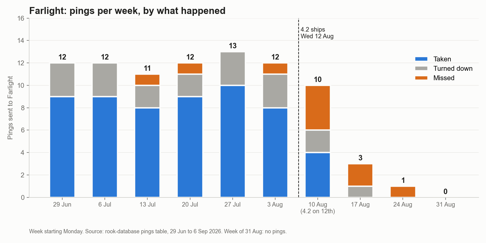
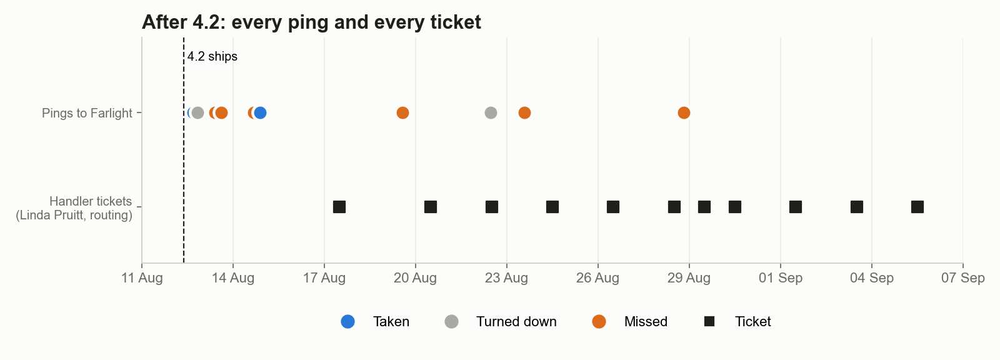
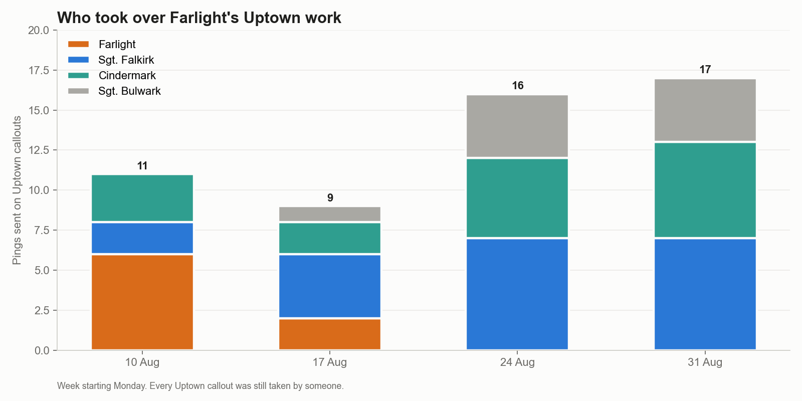

# Case study: Farlight goes quiet

DRAFT, prepared 7 Oct 2026. Farlight is a cover name; nothing here tries to identify the person behind it. Handler: Linda Pruitt.

Sources: rook-database (pings, callouts, support tickets), 29 Jun to 6 Sep 2026; `00-rook/data/callout-history.csv`; `00-rook/4-2-executive-summary.md`. Weeks start on Monday. Release 4.2 shipped on Wednesday 12 Aug.

## The short version

| | Before 4.2 (29 Jun to 11 Aug) | After 4.2 (12 Aug to 6 Sep) |
|---|---|---|
| Pings sent | 75 (about 12 a week) | 11 |
| Taken | 55 (73%) | 2 (18%) |
| Turned down | 17 (23%) | 2 (18%) |
| Missed | 3 (4%) | 7 (64%) |

Her last taken ping was on 14 Aug, two days after 4.2. She got no pings at all in the week of 31 Aug.

## Week by week

| Week | Pings | Taken | Turned down | Missed | What happened |
|---|---|---|---|---|---|
| 29 Jun | 12 | 9 | 3 | 0 | Normal. |
| 6 Jul | 12 | 9 | 3 | 0 | Normal. |
| 13 Jul | 11 | 8 | 2 | 1 | Normal. One missed ping. |
| 20 Jul | 12 | 9 | 2 | 1 | Normal. Linda asks how to mark a cracked vest plate requisition as urgent (ticket 3021). |
| 27 Jul | 13 | 10 | 3 | 0 | Best week of the summer. |
| 3 Aug | 12 | 8 | 3 | 1 | Normal. |
| 10 Aug | 10 | 4 | 2 | 4 | **4.2 ships Wednesday.** Mon 10 and Tue 11: 3 pings, all answered (2 taken, 1 turned down). Wed to Fri: 7 pings, 4 missed, 2 taken, 1 turned down. |
| 17 Aug | 3 | 0 | 1 | 2 | Pings nearly stop. Linda files the first ticket: "phone has not gone off in 3 days" (3060). Nothing taken all week. |
| 24 Aug | 1 | 0 | 0 | 1 | One ping, missed. Linda: "I would rather know than guess" (3089). |
| 31 Aug | 0 | 0 | 0 | 0 | Nothing. Four more tickets this week; Farlight asks Linda to pass on "nothing again this week, starting to wonder if im still even in the system" (3120). |

## The days that mattered

- **Wed 12 Aug.** Three pings. One taken in the afternoon. Then a miss at 19:51, and a turn-down at 20:02, 11 minutes later.
- **Thu 13 Aug.** Two pings, both missed (09:45 and 14:51).
- **Fri 14 Aug.** One missed (16:32), then one taken (21:22). This is her last taken ping.
- **Wed 19 Aug.** One ping, missed. She was second in line, after Sgt. Falkirk turned the callout down.
- **Sat 22 Aug.** One ping, turned down.
- **Sun 23 Aug.** One ping, missed. Linda later writes that nothing came through "since Sunday 23 August" (3099).
- **Fri 28 Aug.** One ping, missed. This is the last ping she received. Linda's ticket that day: "Is Farlight still on the list?" (3103). The next ticket, on 29 Aug, is "First one in 5 days and she missed it" (3110).

Four of her first seven post-4.2 pings were missed within about 48 hours. That is the likeliest starting point. We cannot see how long she would have taken to answer, because the pings table has no response time.

## Where did her work go?

Most of her pings were for Uptown callouts. Uptown callouts kept coming (6 to 10 a week) and every one in the period was taken by someone. Farlight went from 6 Uptown pings in the week of 10 Aug to 0 by 24 Aug. Sgt. Falkirk's Uptown pings went from 2 to 7 a week, and Cindermark's from 3 to 6. Sgt. Bulwark started getting 4 a week.

So the area was covered, and the cost showed up elsewhere: a responder who may think she is out of the system, and three others carrying more.

## What Linda and Farlight experienced

- 11 routing tickets from 17 Aug to 5 Sep (3060, 3071, 3081, 3089, 3099, 3103, 3110, 3114, 3120, 3130, 3139). All 11 are still open.
- Her first message is neutral ("Could someone check yours?"). By late August she is saying "I do not know what to tell her."
- No reply is recorded on any ticket in the database. We have not checked whether anyone answered outside the system.
- Linda also had two Supply items before the drop: a cracked vest plate (3021, closed) and worn cold-weather gloves (3027, closed). Sgt. Falkirk, who picked up the extra Uptown work, has his own open grapple-line complaint (3022).

## What this does and does not show

Shown by the data:
- Her pings fell by about 90% within two weeks of 4.2, and almost all of them after 12 Aug were missed or turned down.
- Her area's work did not disappear. It moved to others.
- Her handler noticed within five days and kept reporting for three weeks.

Hypotheses, not shown:
- Early misses lowered her rank, and fewer pings followed. In the code a miss costs 0.12 of her recent-acceptance score, with no way to recover. We have not confirmed that the running system matches the code or computed her actual score.
- The 60-second ping wait caused the early misses. Two changes shipped together, and the data cannot separate them.
- The 4.2 re-weighting toward proximity changed her order for reasons we have not examined. Her position relative to Falkirk and Cindermark is unknown.
- The pings table does not say why she missed. A phone problem, a quiet shift or a person in the middle of suiting up all look the same.

## Questions this raises

1. Why did the total number of pings she received drop so far, not just her acceptance? (Wen Li: ranking and rank recovery; priorities tasks 3 and 5.)
2. Can we replay 12 to 14 Aug with the old 90s wait and old weights to see whether those seven pings go differently? (Marcus; task 7.)
3. Who should answer Linda's 11 open tickets now? (Nadia; task 1.)
4. Do the other three starved responders (The Undertow, Vesper, Meteor Mite) follow the same curve? The weekly numbers suggest yes.
