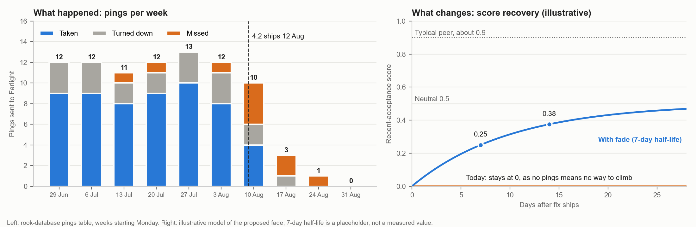

# Quiet responders: what we'd build, seen from the person it happens to

For Helen · 9 Oct 2026 · Draft. **This is what we would do if we're right.** Our hypothesis (not yet confirmed against live scores): 4.2's 60-second wait caused a run of misses, each miss cut the responder's ranking score by 0.12, and because the score only changes when someone is pinged, they could never climb back. Farlight is a cover name; nothing here tries to identify anyone.

> ## The problem
> **Since 4.2, four responders have almost stopped getting pings, and nothing they do can change it.** Their area's callouts still get answered, because other responders take them, so the aggregate numbers look fine. The responders are left wondering whether they've been dropped, and their handlers have no way to see or explain it.

> ## The fix
> **A responder's recent-acceptance score eases back toward neutral (0.5) on its own over time, pinged or not, and a responder who goes N days without a ping shows as quiet on the console.** A bad stretch stops being permanent, and a quiet responder stops being invisible. This settles Wen's 2019 question in favour of "a bad month shouldn't still be carrying it in the spring."

## 1. Who it's for

**Farlight (Uptown), and Linda Pruitt, the handler who speaks for her.** One of four responders who went quiet after 4.2. Before: about 12 pings a week, 73% taken. After: 11 pings in about four weeks, 2 taken, 7 missed, none in the week of 31 Aug. Her area's callouts kept coming and neighbours took them, so nothing went unanswered, but she wonders "if im still even in the system" (ticket 3120). Linda filed 11 tickets; all are open with no recorded reply. Handlers like Kip see the other side: Meteor Mite starved, The Gale swamped (about 1 vs 21 pings a week). The aggregate hid this, because the other twelve responders are fine.

## 2. What changes for them

- **Farlight:** her score starts rising the day it ships, with no ping needed. She earns the rest by taking pings. Expect weeks, not days (a placeholder 7-day half-life takes a score of 0 to about 0.25 in a week and 0.375 in two).
- **Linda and Kip:** the quiet flag shows the date of a responder's last ping, so "Is she still on the list?" gets a visible answer, not a ticket. Because the fade works on everyone, a swamped responder's lead also narrows.
- **Support (Nadia):** the 30 starvation tickets get a true reply.
- **Measure** (per responder, at 2 and 4 weeks): Farlight back toward about 12 pings a week, 70%+ taken, under 5% missed.

## 3. What it deliberately doesn't do

- **Revert 4.2.** Proximity weighting was a long-standing ask and stays.
- **Change the 60s wait, or the proximity weight.** We can't separate the wait from the weights yet. The fade restores her only to neutral: a neighbour on 0.9 still leads by about 7.5 minutes of travel, and 4.2 halved how far a good record can offset distance. Test both in a replay before touching them.
- **Promise anyone a ping, rank or date.** It removes a trap; it is not a quota.
- **Explain why these four miss about 4x as often as peers.** Biggest risk: if they keep missing at 60s, the fade only slows the slide.
- **Add a handler override or setting,** touch the availability record's shape, or use anything but cover names.
- **Add mutual aid or shared cover** (Q4 explorations; shared cover needs a confidentiality review).
- **Settle Supply.** Supply schedules gear servicing into "quiet" windows from the availability record. Starvation may have made the four look idle, and neighbours are carrying extra load. The fix shifts load again. *Open question now:* how does Supply define a quiet window, and has it booked servicing for the four since 12 Aug? *Before ship:* tell the Supply PM. *Fast follow:* check scheduling at 2 to 4 weeks (4 post-4.2 tickets are the baseline).

## Before this goes further

Wen Li and Marcus to confirm: live scores for the four (near 0 supports us), whether scores persist across releases, how production builds its candidate pool (it pings neighbouring areas first, unlike the repo), and travel-time gaps in Uptown. Marcus to replay 12 to 14 Aug one change at a time and set the fade rate. Clickable prototype (Farlight's phone view and Linda's console) not yet built.
